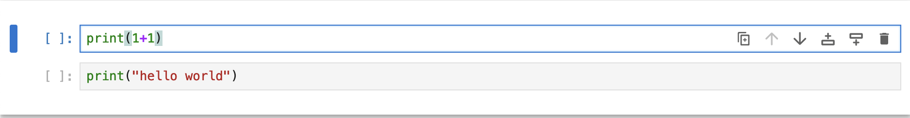

# Introduction to NumPy

This repository contains the materials for an introductory NumPy workshop.

It will be given for the first time at the EuroScipPy 2024 conference in Szczecin, Poland.

The target audience are beginners with no prior experience with NumPy.

The workshop is designed to be interactive and hands-on.

## Installation instructions

### Local mode (recommended)

#### Choose your environment

If you already have installed Python and standard tools (such as `git`), you probably
already have made those choices. If not, here are some recommendations.

On **Windows**, you can run many of the tools natively, but some tools are more
comfortable to use in a Unix-like environment. There will be a few terminal
commands in the rest of the tutorial, they will be given in a Unix-like format.
Here are some options. Choose one of them:
- [Windows Subsystem for Linux](https://learn.microsoft.com/en-us/windows/wsl/install)
  (WSL) (recommended)
- [Docker](https://docs.docker.com/desktop/install/windows-install/)
- Native Windows Python: see
  [Microsoft's doc](https://learn.microsoft.com/en-us/windows/python/beginners)

In the first two cases, this will let you run an Ubuntu terminal on your Windows
machine, which you can use to run the commands below.

On **Mac OS**, you can use the built-in terminal, and install most tools
using [Homebrew](https://brew.sh/).

On **Linux**, you can use the built-in terminal, and install most tools
using your package manager (e.g., `apt` on Ubuntu).

#### Clone the repository

If it's not already done, install `git` on your machine.

**Mac OS**: `brew install git`.

**Windows** (if you're not using WSL or Docker): Consult the [official website](https://git-scm.com/download/win)

**Debian/Ubuntu/WSL**: `sudo apt install git` for Debian-based distributions.

Then, open your terminal, go to your working folder, and clone this repository by running the following command:

```console
$ git clone git@github.com:SdgJlbl/numpy-introduction-tutorial.git
```

This will create a new folder named `numpy-introduction-tutorial`, and you can move into it with:

```console
$ cd numpy-introduction-tutorial
```

#### Install Python and the required packages

This tutorial requires a Python env (Python 3.12) with the following packages installed:
- numpy 2.26.4
- jupyter 1.0.0

⚠️ **Don't install these packages on your system Python, use a virtual env or conda env.**

If you're unsure how to proceed, you can find detailed installation instructions below.

`miniconda` is very popular in the scientific Python community, so we recommend using it.

You can also use `pyenv` + `venv` as an alternative.

##### With miniconda

Follow the
[instructions](https://docs.anaconda.com/miniconda/miniconda-install/) for your
OS to install miniconda.

Create a new environment with Python 3.12 (launch this command once):

```console
$ conda create -n numpy-tutorial python=3.12 numpy=1.26.4 jupyter=1.0.0
```

Every time you want to work on the tutorial in a new terminal, activate your
conda environment and start the Jupyter notebook:

```console
$ conda activate numpy-tutorial
$ jupyter notebook
```

The Jupyter interface should open in your default browser.


##### An alternative to miniconda: pyenv + venv

(Note: `pyenv` does not work on Windows natively but works fine on WSL or Docker)

Follow the
[instructions](https://github.com/pyenv/pyenv?tab=readme-ov-file#installation)
to install `pyenv`.

Then, install Python 3.12 with `pyenv`:

```console
$ pyenv install 3.12
```

Set this version as your global Python version:

```console
$ pyenv global 3.12
```

Create a new virtual environment with Python 3.12:

```console
$ python -m venv numpy-tutorial
$ numpy-tutorial/bin/pip install numpy==1.26.4 jupyter==1.0.0
```

Every time you want to work on the tutorial in a new terminal, activate your
environment and start the Jupyter notebook:

```console
$ source numpy-tutorial/bin/activate
$ jupyter notebook
```

### Using JupyterLite

[](https://sdgjlbl.github.io/numpy-introduction-tutorial/)

If you don't want to install anything on your machine, you can follow along using JupyterLite from your browser.
Click on the badge, and a Jupyter lab interface will open in a new tab. 

Supported browsers are:

- Firefox 90+
- Chromium 89+


## Jupyter commands crash course

* Starting Jupyter notebook from your terminal (with your environment activated):
```console
$ jupyter notebook
```

* This will open a new tab in your default browser with the Jupyter interface.
  You will see the files in the current directory. Click on the notebook you
  want to open or create a new one (`New` -> `Python 3 (...)`).

* When you're in a notebook, you can create, move and delete cells. Cells
  contain either code or instructions. You can execute the code in a cell with
  `Shift + Enter`.

* Be careful: When a cell is selected, either you're typing code in it (edit
  mode), or it's just selected (command mode). In command mode, typing some
  letters will trigger commands instead of typing them in the cell. If you're
  typing in a cell and nothing happens, you're probably in command mode. Press
  `Enter` to go back to edit mode. From edit mode, press `Esc` to go back to
  command mode from edit mode.

Command mode:


Edit mode:


* Sometimes, you'll find that you can't execute a cell. It's probably because
  it was inadvertently set to Markdown mode. You'll see the dropdown menu at the
  top of the screen say "Markdown". Change it to `Code` to be able to execute the cell.

Cell in Markdown mode:


Cell in Code mode:


* On exercise cells, they will often be followed by `# %load filename.py`. If
  you're stuck, you can uncomment (i.e. remove the initial `#`) this line and
  execute (`Shift + Enter`) the cell to load the solution.

* Stopping the Jupyter notebook server: `Ctrl + C` twice in the terminal where you launched it.

## How to follow the workshop

We will go through the notebooks together. You will be able to execute the code
in the cells, and you can also modify it to experiment with the concepts we'll
cover. In the exercises, you will have to complete the code to make it work.

At any time, you can ask questions if you're stuck or if you want to know more
about a specific topic.
It's perfectly fine if you want to go faster, there is a lot of material in
the notebooks, and we won't have time to cover everything anyway, so feel free
to go at your own pace.

## Special thanks

This content is vastly inspired by [Maria Telenczuk's tutorial](https://github.com/maikia/numpy-demo?).

Many thanks to @ewjoachim for his thoughtful review and comments.

## License

<a rel="license" href="http://creativecommons.org/licenses/by-sa/4.0/"></a><br />

This work is licensed under a [Creative Commons Attribution-ShareAlike 4.0 International License](http://creativecommons.org/licenses/by-sa/4.0/).